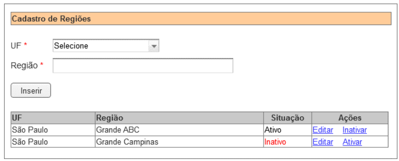

# Avaliação para Desenvolvedor Web Júnior - Frontend

## Resultado Esperado

Esta avaliação espera como resultado um frontend funcional feito em Vue.js. O frontend deve consumir um backend que já está pronto e que será falado mais frente.

## Requisito a Ser Desenvolvido

### Implemente o CRUD de regiões, protótipo abaixo.

*Atenção: Este é apenas um protótipo, use suas habilidades para criar um front inspirador, mas intuitivo e funcional.*

### Regras

*Atenção: Algumas destas regras já estão implementadas na API (backend). A API trata e retornando o erro, basta redirecionar ao usuário.*

- Todos os dados são obrigatórios para inserir uma nova região.
- Não pode haver mais de uma região com o mesmo nome para o mesmo estado (UF), mesmo que
inativa.
- Ordenar as regiões cadastradas por UF, seguido de região.
- Para regiões ativas, exibir a opção “Inativar”.
- Para regiões inativas, exibir a opção “Ativar”.
- Ao clicar em “Inativar”:
  - Exibir mensagem de confirmação antes de inativar uma região.
  - Inativar o registro (não excluir fisicamente).
- Ao clicar em “Editar”:
  - Carregar a região e UF nos campos acima do grid.
  - Ao clicar em Gravar: atualizar os dados, limpar os campos e recarregar o grid.
-  Ao clicar em “Ativar”, atualizar a situação do registro para ativo.

### Tecnologia Frontend

Utilizar o **Vue.js 3** para implementar o requisito no frontend.

---

## Sobre a API Backend

*Atenção: A API já está pronta e basta ser executada.*

A API faz o **cadastro e gerenciamento de regiões**. Foi desenvolvida em C#.Net com arquitetura simplificada para ser consumida por um frontend independente.

O sistema permite a **criação, listagem, edição, ativação e inativação** de regiões.

Este projeto tem como objetivo ser um backend base para uma avaliação de desenvolvimento de um frontend em `Vue.js`.

## Como executar o projeto API?

### Pré-Requisitos de Ferramentas Instaladas
- Visual Studio Comunity (VSC)
- PostgreSQL

### Preparação do Banco de Dados
- No VSC, abra o arquivo `appsettings.json` e ajuste em *"ConnectionStrings > DefaultConnection"* o usuário e senha para acesso ao BD.
- No VSC, no *"Console Gerenciador de Pacotes", Selecione o projeto "RegionAPI"* e execute o comando `Update-Database`, para criar o banco de dados.

### Executar a API
- Agora basta apertar a tecla F5 no VSC para executar o projeto e levantar a API.
- Provalmente ela irá rodar no endereço https://localhost:7278. Confirme olhando o endereço que será aberto automaticamente no navegador após ter pressionado o F5.
- Use este endereço na sua aplicação frontend.

---

## Como enviar o projeto?

Crie um projeto no **seu perfil do GitHub** para ir commitando a evolução do seu código.

Ao final, favor enviar o link do projeto GitHub para andre@adaptum.com.br.
